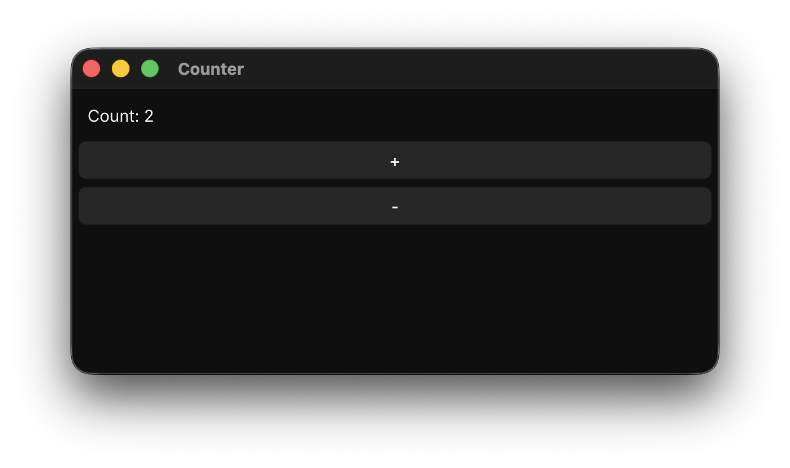

# Gova

**The declarative GUI framework for Go.** Build native desktop apps for macOS,
Windows, and Linux from a single Go codebase — typed components, reactive
state, real platform dialogs, and one static binary. No JavaScript runtime, no
embedded browser, no C++ toolchain to learn.

[](https://pkg.go.dev/github.com/nv404/gova)
[](https://goreportcard.com/report/github.com/nv404/gova)
[](https://github.com/nv404/gova/actions/workflows/ci.yml)
[](LICENSE)

> **Status:** pre-1.0. The API will shift before `v1.0.0`. Pin a tag in
> production.

```go
package main

import . "github.com/nv404/gova"

var Counter = Define(func(s *Scope) View {
    count := State(s, 0)
    return VStack(
        Text(count.Format("Count: %d")),
        Button("+", func() { count.Update(func(n int) int { return n + 1 }) }),
        Button("-", func() { count.Update(func(n int) int { return n - 1 }) }),
    )
})

func main() { Run("Counter", Counter) }
```

<p align="center">
  
</p>

## Why Gova

- **Components as structs.** Views are plain Go structs with typed prop fields;
  defaults are zero values; composition is plain function calls. No magic
  property wrappers, no string keys, no hook-ordering rules.
- **Explicit reactive scope.** State, signals, and effects live on a `Scope`
  you can see. No hidden scheduler, no re-render surprises, no Rx, no Redux.
- **Real native integrations where it matters.** `NSAlert`, `NSOpenPanel`,
  `NSSavePanel`, and `NSDockTile` badge/progress/menu on macOS through cgo.
  Fyne fallbacks on Windows and Linux — same API everywhere.
- **One static binary.** `go build` produces a single executable. No
  JavaScript runtime, no embedded browser, no extra assets to bundle.
- **Hot reload that actually reloads.** `gova dev` watches Go files, rebuilds
  on save, and relaunches — with an opt-in `PersistedState` so UI state
  survives the reload.
- **Built on Fyne, but Fyne stays internal.** The public API is yours to rely
  on. We swap out renderer details without breaking your code.

## At a glance

| Metric        | Value     | Notes                               |
|---------------|-----------|-------------------------------------|
| Binary size   | ~32 MB    | `counter` example, default build    |
| Stripped      | ~23 MB    | `go build -ldflags "-s -w"`         |
| Memory idle   | ~80 MB    | RSS, `counter` running              |
| Go version    | 1.26+     | plus a C toolchain for cgo          |
| License       | MIT       | no runtime fees                     |

Measured on macOS arm64 with Go 1.26.2. Numbers will vary by platform and
feature set.

## Install

```bash
go get github.com/nv404/gova@latest
```

Optional CLI for `dev` / `build` / `run`:

```bash
go install github.com/nv404/gova/cmd/gova@latest
gova dev ./examples/counter
```

Prerequisites: **Go 1.26+** and a C toolchain (Xcode CLT on macOS,
`build-essential` + `libgl1-mesa-dev` on Linux, MinGW on Windows).

## Docs

Full documentation lives at **[gova.dev](https://gova.dev)** (or run
`npm run dev` inside `docs-site/` for local browsing). Key sections:

- [Getting started](https://gova.dev/docs/getting-started/installation)
- [Core concepts](https://gova.dev/docs/concepts/components)
- [State and effects](https://gova.dev/docs/state/state)
- [Native dialogs](https://gova.dev/docs/overlays/native-dialogs)
- [Platform integration](https://gova.dev/docs/platform/dock)
- [CLI](https://gova.dev/docs/cli/overview)

## Examples

Every example in [`examples/`](./examples) is a runnable program:

| Example       | What it shows                                          |
|---------------|--------------------------------------------------------|
| `counter`     | The minimum viable Gova app                            |
| `todo`        | State, lists, forms                                    |
| `fancytodo`   | Categories, derived state, richer layout               |
| `notes`       | Nav, multi-view, stores                                |
| `themed`      | Dark/light mode, semantic colors                       |
| `components`  | `Viewable` composition, `ZStack`, `Scaffold`           |
| `dialogs`     | Native dialogs, dock badge / progress / menu, app icon |

```bash
go run ./examples/dialogs
```

## Platform support

| Feature                   | macOS                 | Windows         | Linux           |
|---------------------------|-----------------------|-----------------|-----------------|
| Core UI                   | Supported             | Supported       | Supported       |
| Hot reload (`gova dev`)   | Supported             | Supported       | Supported       |
| App icon (runtime)        | Supported             | Supported       | Supported       |
| Native dialogs            | NSAlert / NSOpenPanel | Fyne fallback   | Fyne fallback   |
| Dock / taskbar            | NSDockTile            | Planned         | Planned         |

## CLI

The `gova` CLI ships alongside the framework.

| Command       | Purpose      | Notes                                                      |
|---------------|--------------|------------------------------------------------------------|
| `gova dev`    | Hot reload   | Watch `.go` files, rebuild on save, relaunch the window    |
| `gova build`  | Compile      | Static binary to `./bin/<name>`                            |
| `gova run`    | Execute      | Build and launch once, no file watching                    |

## Contributing

See [CONTRIBUTING.md](CONTRIBUTING.md). Tests are the contract:

```bash
go test ./...
```

Issues, discussions, and PRs all live on
[GitHub](https://github.com/nv404/gova). Security issues? See
[SECURITY.md](SECURITY.md).

## License

[MIT](LICENSE). Gova is built on [Fyne](https://fyne.io) (BSD-3), which ships
with the module as an internal dependency.
